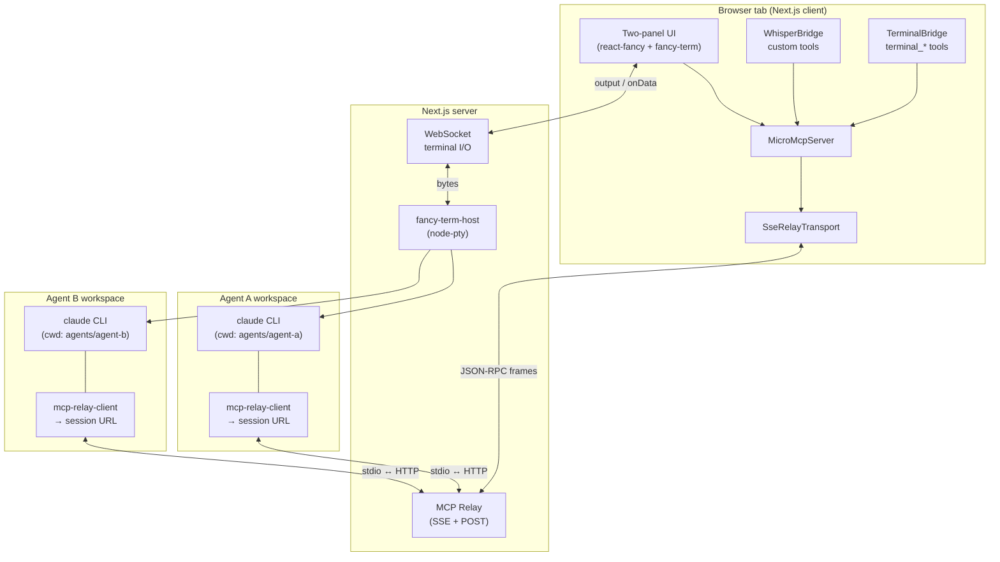
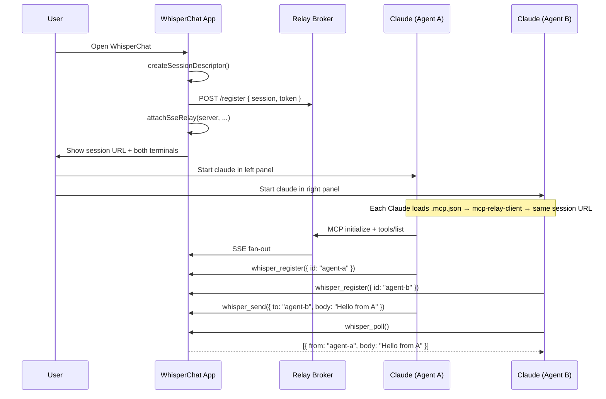

# 02 — Architecture

## Design goal

Demonstrate that **two independent Claude Code sessions** — each in its own terminal, each with its own folder root and `CLAUDE.md` — can **exchange messages through a shared MCP session** hosted by the WhisperChat web app, **without writing files** to communicate.

## High-level diagram



## Three layers

### Layer 1 — Presentation (browser)

| Piece | Package | Role |
|-------|---------|------|
| Page chrome, split layout, headers | `react-fancy` | Two equal panels, connection status, copy-share-link button |
| Terminal surfaces | `fancy-term` | Renders scrollback; sends keystrokes upstream |
| MCP host | `agent-integrations` | Registers tools; attaches relay transport |

The browser owns **all shared state**: whisper inboxes, connected peer list, terminal bridge adapters.

### Layer 2 — Transport (Next.js server)

| Piece | Role |
|-------|------|
| **WebSocket handler** | Streams PTY stdout → client `output`; client `onData` → PTY stdin |
| **PTY manager** | `fancy-term-host` creates one shell per panel, `cwd` set to agent folder |
| **MCP relay** | Implements relay protocol: `register`, `inbox`, `outbox`, `events` (SSE). Can use bundled `agent-integrations-relay` or port endpoints into Next.js API routes |

The relay is intentionally **dumb**: it forwards JSON-RPC frames; it does not run tools or hold whisper message content long-term (the browser does).

### Layer 3 — Agents (inside PTYs)

Each panel starts (manually or via a "Launch Claude" button) a shell in:

```
agents/
├── agent-a/
│   └── CLAUDE.md      ← persona + instructions for Agent A
└── agent-b/
    └── CLAUDE.md      ← persona + instructions for Agent B
```

Each `CLAUDE.md` tells the agent:

1. Its **identity** (`agent-a` or `agent-b`)
2. That cross-agent messaging uses MCP tools `whisper_register`, `whisper_send`, `whisper_poll` — **not files**
3. The MCP server is already configured via project `.mcp.json` pointing at `mcp-relay-client` + the session URL

## Session lifecycle



## Why one MCP server, two agents?

`MicroMcpServer` supports **multiple transports** and **multiple remote clients** on the same session. Both Claude instances connect to the **same relay URL** but register **different peer IDs**.

This is simpler than two MCP servers and matches how Fancy UI's Agent Playground works: one hosted surface, many external agents.

Alternative (not MVP): separate sessions + a forwarding layer. Rejected for MVP complexity.

## Terminal bridge vs whisper bridge

Both register on the same `MicroMcpServer`:

| Bridge | Tools | Purpose in WhisperChat |
|--------|-------|------------------------|
| **Terminal** | `terminal_list`, `terminal_read`, `terminal_write`, `terminal_run`, … | Optional: let an agent read the *other* panel's terminal (powerful; gate behind `pendingMode` for MVP) |
| **Whisper** (custom) | `whisper_register`, `whisper_send`, `whisper_poll`, `whisper_peers` | **Primary MVP channel** — structured agent-to-agent messages |

MVP demo script should use **whisper tools only** so the proof is clearly "not files, not stdin injection."

## Security notes (MVP vs production)

**MVP (local dev):**

- Session token in URL is sufficient
- Relay on `localhost` only
- Agent folders are sandboxed subdirectories

**Production (later):**

- Short-lived tokens, explicit revoke
- Rate limits on whisper_send
- Auth on relay endpoints
- `pendingMode: true` on terminal bridge if agents can write to each other's terminals

## Failure modes

| Symptom | Likely cause |
|---------|--------------|
| Claude doesn't see whisper tools | MCP client not connected; wrong session URL; relay not registered |
| Messages never arrive | Sender didn't `whisper_register`; wrong `to` id; poll not called |
| Terminal blank | WebSocket disconnected; PTY not spawned; `output` state not wired |
| Both agents same identity | `CLAUDE.md` or register call used same id — second registration should error |

## Repo layout (proposed)

```
whisper-chat/
├── app/
│   ├── layout.tsx                 # fonts, global styles
│   ├── page.tsx                   # WhisperChat page (client)
│   └── api/
│       ├── relay/[...path]/route.ts   # relay broker endpoints
│       └── terminal/ws/route.ts       # WebSocket upgrade (or separate ws server)
├── components/
│   ├── WhisperChatShell.tsx       # split layout + session bootstrap
│   ├── AgentPanel.tsx             # one side: label + Terminal + status
│   └── SessionBar.tsx             # share URL, connection indicators
├── lib/
│   ├── mcp/
│   │   ├── createWhisperServer.ts # MicroMcpServer factory
│   │   └── whisperBridge.ts       # whisper_* tool registration
│   └── terminal/
│       └── ptyManager.ts          # fancy-term-host wrapper
├── agents/
│   ├── agent-a/
│   │   ├── CLAUDE.md
│   │   └── .mcp.json              # mcp-relay-client → session URL template
│   └── agent-b/
│       ├── CLAUDE.md
│       └── .mcp.json
├── docs/                          # this folder
└── package.json
```
