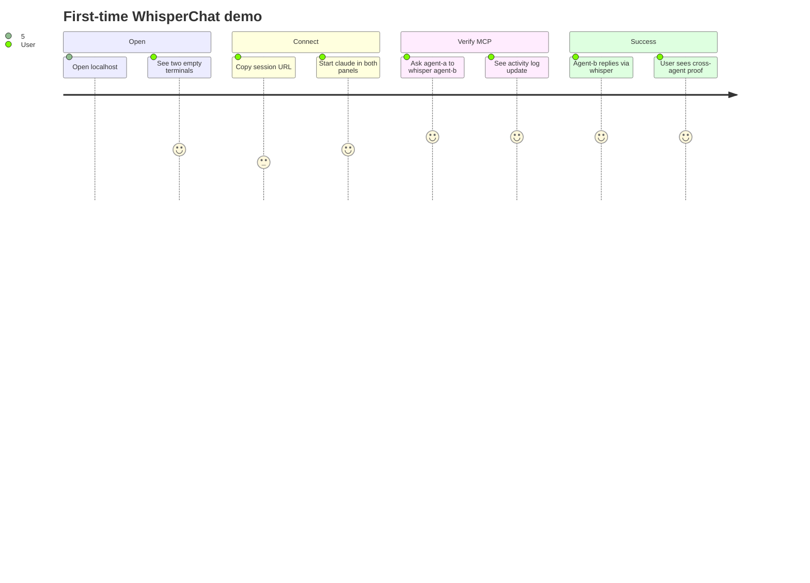

# 04 — UI & UX Layout

WhisperChat is a **full-viewport, two-panel** workspace. Each panel is one agent's world: a labeled terminal running Claude in an isolated folder.

## Layout wireframe

```
┌─────────────────────────────────────────────────────────────────────────────┐
│  WhisperChat          [● Relay connected]  [Copy session URL]  [Reset]      │
├──────────────────────────────┬──────────────────────────────────────────────┤
│  AGENT A — Researcher        │  AGENT B — Coder                             │
│  ~/agents/agent-a            │  ~/agents/agent-b                            │
│  ┌────────────────────────┐  │  ┌────────────────────────────────────────┐  │
│  │                        │  │  │                                        │  │
│  │   fancy-term           │  │  │   fancy-term                           │  │
│  │   (xterm.js)           │  │  │   (xterm.js)                           │  │
│  │                        │  │  │                                        │  │
│  │   $ claude             │  │  │   $ claude                             │  │
│  │                        │  │  │                                        │  │
│  └────────────────────────┘  │  └────────────────────────────────────────┘  │
│  [Launch Claude] [Clear]     │  [Launch Claude] [Clear]                       │
├──────────────────────────────┴──────────────────────────────────────────────┤
│  Whisper activity (collapsible)                                             │
│  12:01  agent-a → agent-b   "Please write fibonacci in Python"              │
│  12:02  agent-b → agent-a   "Here's the implementation: def fib(n)..."      │
└─────────────────────────────────────────────────────────────────────────────┘
```

## Component map

| UI region | react-fancy / fancy-term | Notes |
|-----------|--------------------------|-------|
| App shell | `Panel`, typography tokens | Dark theme matching fancy-term default |
| Split container | CSS grid `1fr 1fr` or react-fancy layout primitive | Resizable split is nice-to-have, not MVP |
| Session bar | `Button`, `Badge`, copy-to-clipboard | Shows relay + peer connection status |
| Agent panel header | Text + optional `Badge` (online/offline) | Displays folder path |
| Terminal | `<Terminal>` from `fancy-term` | Fixed height: `calc(100vh - header - footer)` |
| Whisper log | `Panel` + scrollable list | Driven by whisper `transcript` state |
| Connector affordance | `ConnectorButtons` from agent-integrations (optional) | Helps users add MCP to Claude Desktop |

## Agent panel anatomy

Each `AgentPanel` owns:

```typescript
type AgentPanelProps = {
  side: "a" | "b";
  agentId: "agent-a" | "agent-b";
  label: string;
  cwd: string;                    // absolute path to agents/agent-a
  terminalId: string;             // for TerminalBridge: "term-a" | "term-b"
  output: string;
  onData: (data: string) => void;
  onLaunchClaude?: () => void;
};
```

### Terminal wiring

```tsx
<div className="h-[calc(100vh-12rem)] min-h-[320px]">
  <Terminal
    output={output}
    onData={onData}
    fit
    fontSize={14}
    data-fancy-terminal={terminalId}
  />
</div>
```

The `data-fancy-terminal` attribute gives MCP bridges a stable handle (Human+ UX contract).

### Launch Claude button

MVP behavior: send `claude\r` into the PTY via backend `write()`. The shell must already be at the correct `cwd` (set when PTY was created).

Alternative: show instructions *"type `claude` and press Enter"* — zero automation, still valid MVP.

## Session bar UX

### Copy session URL

Primary action after page load. The URL format follows Fancy UI conventions:

```
http://localhost:3000/?session=<id>&token=<secret>
```

Or relay-centric:

```
http://localhost:3000/api/relay/<id>/inbox?token=<secret>
```

Use `buildShareUrl` from `agent-integrations` for consistency.

### Status indicators

| Indicator | Meaning |
|-----------|---------|
| Relay: connected | `SseRelayTransport` state === `open` |
| Peers: 0/2 | Registered whisper peers |
| Peers: 2/2 | Both agents registered — ready for demo |

### Reset session

- Clears whisper inboxes and peer registrations
- Rotates token (requires re-register by Claude sessions)
- Does **not** kill PTYs by default (user may want shells to stay open)

## Visual design tokens

Use Fancy UI defaults — don't fight the kit:

```tsx
import "@particle-academy/react-fancy/styles.css";
import "@particle-academy/fancy-term/..."; // xterm.css via fancy-term docs
import "@particle-academy/agent-integrations/styles.css";
```

Tailwind v4 setup (in `app/globals.css`):

```css
@import "tailwindcss";
@source "../node_modules/@particle-academy/react-fancy/dist/**/*.js";
```

Dark background, monospace in terminals, sans-serif in chrome — matches Agent Playground aesthetic on ui.particle.academy.

## Responsive behavior

MVP targets **desktop only** (≥1024px). Below that, stack panels vertically with a tab switcher. Mobile is out of scope for the cross-terminal demo.

## Accessibility

- Each panel: `aria-label="Agent A terminal"`
- Session URL copy button: announce success toast
- Whisper log: live region (`aria-live="polite"`) for new messages

## User journey (first visit)



## What we deliberately hide in MVP

- File tree / editor (not the point)
- Agent cursor overlays (no whiteboard)
- Multi-user auth
- Terminal `pendingMode` confirmation UI (enable later when exposing cross-terminal write)

## Optional enhancements (post-MVP)

| Feature | Package hook |
|---------|--------------|
| Agent chat sidebar | `AgentPanel` from agent-integrations |
| Show MCP tool calls live | Subscribe to `notifications/agent_activity` |
| Resizable split | react-fancy split pane or `react-resizable-panels` |
| Session persistence | fancy-term-host T1 snapshots |
